# Plan: BBC_OS Snowflake-native implementation through M1

## 1. Context

### Account state (checked read-only)
- **`BBC_OS` has never existed here.** `SHOW DATABASES HISTORY` shows no live or dropped copy.
- **None of the v2 objects exist yet:**
  - the 9 v2 roles (`BBC_OWNER` … `BBC_GOVERNANCE_ADMIN`);
  - `BBC_TRANSFORM_WH` and `BBC_APP_WH`;
  - `BBC_MONITOR`;
  - the 8 `BBC_*_SVC` / `BBC_DEMO_*` users.
- **Only v1 is present:** `BLUEBERRY_CHAIN`, `BBC_WH`, `BBC_DT_WH`, and the roles `BBC_AGENT_ROLE`, `BBC_*_ROLE`.
  - The approved plan says these stay untouched unless you confirm a teardown, so this plan doesn't change them.

### Repo state (branch `rebuild/v2`, Day 1–5 commits)
- **Source of truth:** [docs/design/implementation-plan.md](docs/design/implementation-plan.md), its "Final decisions" table and errata, plus ADR-0001 to ADR-0007.
- **Written but not deployed:** the modules in `snowflake/modules/` (00, 00b, 05, 10, 20, 30, 40, 50, 55, 60, 61, 62, 70, 80, 81).
  - Each has a CoCo brief: [docs/coco-briefs/](docs/coco-briefs/) WP1, WP2, WP3, WP5, WP6a.
  - Each has 0-row tests in `snowflake/tests/`; `bbc test sql` passes a test when its last statement returns 0 rows.
  - Every brief's result log is blank, and so is ADR-0002's spike table.
- **Python handlers:** `python/bbc_toolkit/src/bbc_toolkit/snow.py` exists only for the procedures already written.
  - It uses `EXECUTE AS OWNER` and imports zips from `@BBC_OS.GOV.CODE` through `bbc deploy python`.
- **Engine:** `python/bbc_engine` already has `engine.evaluate`, `generator`, `rank`, `autonomy.authorize`/`combine`, `physics`, `solver`, and the golden test.
- **Not written:** WP6b, 7a and 7b (procedures, views, tests and briefs) exist only as specs, in Phase 8 §4/§9, Phase 9, Phase 11, Phase 12 and Phase 14 Days 6–8.

### How your 15 tasks map to the approved architecture

| Your task | Covered by |
|---|---|
| 1–2 Structure, tables | WP1, WP2, WP3, WP6a modules |
| 3 Source data | Simulator, then connectors, then `API.INGEST_BATCH`. Nothing is pinned or hardcoded (ADR-0006) |
| 4–5 Transformations, Dynamic Tables | `61_ops_typed`, `62_ops_thermal` |
| 6–7 Semantic view, canonical metrics | `70_semantic_view` (YAML-generated) |
| 8 Decision metrics | Added to the YAML in WP6b and WP7b |
| 9 Governed procedures | WP2, WP3, WP6b, WP7a, WP7b |
| 11 Approvals | `EVALUATE_POLICY`, `DECIDE_APPROVAL` |
| 12 Decision memory (M1 form) | Sealed DECISION records plus ledger |
| 13 Audit | LEDGER, VERIFY, REPLAY |
| 14 Cortex | `CORTEX_USER` and `USE AI FUNCTIONS` grants, semantic view `AI_SQL_GENERATION`, spikes S3, S7, S8 |
| 15 Verification | `snowflake/tests/*` plus the M1 evidence query |

### Out of scope (your choice of "Existing + through M1")
- WP4 evidence: `AI_EXTRACT`, `DOCUMENTS`, `DOCUMENT_CONSISTENCY`.
- WP8a: the 18 agent tools and 4 Cortex Agents.
- WP10: the `MEMORY` schema.
- Claims (D2).
- Track A app work: TS engine worker, dispatcher, UI.

## 2. Execution rules (unchanged conventions)
- **Roles:** BBC_OS objects are created as `BBC_OWNER`; only account-level steps use `ACCOUNTADMIN`.
- **Statement handling:** each module runs statement by statement through `snowflake_sql_execute`, compiled first wherever the objects already exist.
  - Any fix goes back into the `.sql` file; the repo must match the account.
- **Generated files:** `70_semantic_view.sql` and the parity tests are generated by `uv run python -m blueberrychain.sqlgen`, never hand-edited.
- **Data path:** data enters only through the simulator, connectors and API procedures (ADR-0006).
  - No INSERT of business rows. No pinned results.
- **Gates:** after every stage, `uv run bbc test sql <stage tests>` must report all PASS before the next stage starts.
  - Each brief's result log is filled in.
- **Secrets:** PATs are never shown in chat.
  - You run `00b_tokens.sql` yourself (Snowsight, or `! snow sql -c pndvhar-pt70809 -f snowflake/modules/00b_tokens.sql`) and paste the tokens into the gitignored `.env`.

## 3. Implementation steps

### Stage 1: Foundation + spikes (WP1)
1. Run `00_account.sql` as ACCOUNTADMIN.
   - Gate: `snowflake/tests/00_foundation.sql`.
2. **[You]** Generate the 8 PATs from `00b_tokens.sql` and fill `.env` (copied from `.env.example`).
3. Run `spikes/wp1_spikes.sql` S1–S10 in `BBC_OS.SANDBOX`, plus `s8_agent_rest.py` and `s10_lock.py`.
   - Record PASS or FALLBACK with evidence in [docs/adr/0002-snowflake-capabilities.md](docs/adr/0002-snowflake-capabilities.md).
   - Apply any documented fallback before it matters:
     - S1 → interval join in `62`;
     - S2 → scheduled task in `81`;
     - S6 → 1-day retention.
   - Drop `SANDBOX` and `SPIKE_AGENT` afterwards.

### Stage 2: RAW, REF, GOV, ledger (WP2)
4. Run `05_code_stage.sql`, then `uv run bbc deploy python`, then `10`, `20`, `30`, `40`, `50`.
5. Load reference data and policy:
   - `bbc sim init`
   - `bbc ref load`
   - `bbc policy draft` (as builder)
   - `bbc policy activate --as govadmin` (separation of duties)
   - Gate: `02_hash_parity`, `02_ledger`, `02_policy`, `02_reference`.

### Stage 3: Ingest + OPS Dynamic Tables (WP3)
6. Run `55_ingest`, `60_ops_functions`, `61_ops_typed`, `62_ops_thermal`, using the `dynamic-tables` skill.
   - Verify that `refresh_mode` is as designed with `SHOW DYNAMIC TABLES`. The mode you request isn't always the mode you get.
   - Gate: `03_ops`, `03_physics_parity`.

### Stage 4: World data + semantic view (WP5)
7. Start the world: `BBC_STACK_SINK=snowflake pnpm --filter @blueberrychain/dev-stack start`, then `bbc sim run --scenario S-A`.
   - The data flows connectors → `API.INGEST_BATCH` → RAW → DTs.
8. Run `70_semantic_view.sql` (`SEM.EXCURSION_RECOVERY`: 13 tables, 12 relationships, 9 metrics), using the semantic-view skill.
   - Gate: `04_world_consistency`, `05_semantic`.

### Stage 5: Decision store + detection (WP6a)
9. Run `bbc deploy python`, `bbc ref load` (detention rate), then `80_decision_store`, then `81_detection` in the form S2 chose.
10. Run S-B with a later `--depart`, plus `wp6a_case_latency.py`: a case should open within 2 minutes.
    - Gate: `05_case_store`, `02_ledger`.

### Stage 6: Stage procedures + decision metrics (WP6b, new)
11. **Handlers** (new module `bbc_toolkit/stages.py`, plus `validators.py`). Each is wired in `snow.py` and unit-tested against `fake_snowflake.py`.

    | Procedure | What it does |
    |---|---|
    | `BUILD_ASSESSMENT(case_id, dp, as_of)` | Reads canonical metrics **through `SEMANTIC_VIEW(SEM.EXCURSION_RECOVERY …)`** plus OPS/REF at `received_at ≤ as_of`. Seals `EVIDENCE.EVIDENCE_PACKS` (CANONICAL_HASH) and writes the `ASSESSMENT_SEALED` ledger entry |
    | `GENERATE_AND_SCORE_OPTIONS` | Calls `bbc_engine.engine.evaluate`. Writes OPTIONS, always including the default and fallback, plus the brief hash, and `OPTIONS_SCORED` |
    | `ROUTE` | Uses `rank.recommendation_triggers` and `GOV.ROUTER_RULES`. Produces a RULE recommendation, or `STRATEGY_PENDING` with reason codes |
    | `EVALUATE_POLICY` | Uses `autonomy.authorize` / `combine` against the active policy. Writes POLICY_EVALUATIONS and APPROVALS requests, plus `POLICY_EVALUATION` |

12. **Module `snowflake/modules/82_stages.sql`:**
    - the 4 internal procedures above;
    - view `DECISION.V_DECISIONS`;
    - `API.CLAIM_WORK` and `API.ADVANCE_CASE` (expected-state transitions, idempotent);
    - grants to `BBC_ENGINE` only.
13. **Decision metrics.** Extend `snowflake/semantic/excursion_recovery.yaml` with logical tables for cases, case_lots, options, recommendations, policy_evaluations and approvals.
    - Metrics: `CASES`, `TIME_TO_DETECT_MIN`, `TIME_TO_DECISION_MIN`, `DEADLINE_MET_RATE`, `RULE_DECIDED_SHARE`, `AGENT_DECIDED_SHARE`, `HUMAN_OVERRIDE_RATE`, `APPROVAL_LATENCY_MIN`, plus `PLANNED_VALUE_USD`, `DEFAULT_COUNTERFACTUAL_USD` and `VALUE_AT_RISK_USD` from the frozen Brief values.
    - Regenerate `70` with sqlgen. Hash the new metrics into **policy v2** `metric_registry` (draft as builder, activate as govadmin).
14. **Tests:**
    - `snowflake/tests/06_stages.sql`: pack hashed and ledgered; default + fallback present; S-A routes to RULE; L4 Sales approval requested; ADVANCE idempotent.
    - `06_replay.sql`: re-running `BUILD_ASSESSMENT(as_of)` gives the same pack hash.
    - Extend `05_semantic.sql`: the decision metrics match the base-table aggregates.
    - Write the brief `docs/coco-briefs/WP6b-stage-procedures.md` with its result log.

### Stage 7: Mutation gateway (WP7a, new)
15. **Handlers** (`bbc_toolkit/gateway.py`): `MUTATE` with all nine steps from Phase 12.
    - validate (unexpired option, hard constraints re-read, expected before-state);
    - authorize (engine principal only; fresh approvals bound to the brief hash; ceiling, shadow and dispatch flags);
    - the PREPARED record and the ledger entry written in one transaction;
    - metric snapshot re-read through the semantic view, with the drift between it and the frozen values;
    - idempotency key under `GATEWAY_LOCK`; CONFLICT on an in-flight target.

    Plus:
    - `EXECUTE_PLAN` (step ordering, ALL_OR_NOTHING / BEST_EFFORT);
    - `ENFORCE_DEADLINES` (fallback HOLD);
    - `DECIDE_APPROVAL` (`CURRENT_USER`, `IS_ROLE_IN_SESSION`, proposer ≠ approver, brief-hash freshness, deadline);
    - `NEXT_ACTIONS` and `ACK_MUTATION` (idempotent per attempt);
    - `EMERGENCY_STOP`.
16. **Module `snowflake/modules/83_gateway.sql`:**
    - the procedures above;
    - view `API.V_DISPATCHABLE`, which recomputes `authorization_hash`;
    - task `DECISION.T_DEADLINE_WATCHDOG` (1 minute, `BBC_TRANSFORM_WH`).
    - **Grant matrix:**
      - `BBC_ENGINE`: engine API;
      - the three manager roles: `DECIDE_APPROVAL`;
      - `BBC_AGENT_RUNTIME`: nothing on the gateway.
17. **Tests** (`snowflake/tests/07_gateway.sql`):
    - no mutation without `policy_eval_id`;
    - L4 blocked without approval;
    - proposer ≠ approver;
    - a stale brief hash is rejected;
    - a duplicate key returns the existing mutation;
    - CONFLICT on the same target;
    - no IRREVERSIBLE action at L3;
    - no agent principal as the executor;
    - the agent role has no USAGE on MUTATE, EXECUTE_PLAN or REVERSE_DECISION.

    Negative cases run as the persona and service users through `snowcall` with their PATs. Write the brief `WP7a-gateway.md`.

### Stage 8: Outcome + audit, M1 (WP7b, new)
18. **Handlers** (`bbc_toolkit/audit.py`):

    | Procedure | What it does |
    |---|---|
    | `COMPUTE_OUTCOME` | Receipt QC from `OPS.QC_INSPECTIONS` → OUTCOMES (realized NRV vs default) |
    | `SEAL_CASE` | Seals the case; writes `CASE_SEALED` |
    | `API.VERIFY_LEDGER(from, to, table)` | Recomputes the hash chain; also works on a clone |
    | `API.REPLAY_EVIDENCE(pack_id)` | Rebuilds the pack from RAW (`received_at ≤ as_of`) and compares hashes |
    | `API.EXPORT_EVIDENCE_PACK` | Writes JSON to a stage and returns a presigned URL |
    | `API.GET_CASE_VIEW`, view `API.V_CASE_INBOX` | Case read model |
    | `API.REVERSE_DECISION` | Runs compensations through MUTATE |

19. **Module `snowflake/modules/84_outcome_audit.sql`**, with auditor and persona grants.
    - Add the decision/financial metrics `BEAT_DEFAULT_RATE`, `VALUE_PROTECTED_USD`, `REALIZED_NRV_USD` and `FALLBACK_RATE` to the YAML, with registry hashes in policy v3.
20. **Tests** (`snowflake/tests/08_audit.sql`):
    - VERIFY = OK;
    - **tampering with one row in a zero-copy clone of `LEDGER.ENTRIES` is detected at the exact seq**;
    - the replay hash is equal;
    - every sealed case has the full ledger chain;
    - every mutation has a metric snapshot and its approvals.

    Write the brief `WP7b-outcome-audit.md`.
21. **M1 driver** (`snowflake/spikes/m1_drive_case.py`, following the `wp6a_*.py` pattern):
    - a minimal stand-in for the Track A worker/dispatcher;
    - it calls only API procedures, as `BBC_ENGINE_SVC` and the persona users;
    - it applies leased mutations to mock-s4/mock-tms with the idempotency key, then ACKs.

    It replaces neither 6.4 nor 7.3; it only proves the Snowflake contract.
22. **Evidence query** (`snowflake/proofs/m1_lifecycle_evidence.sql`, read-only): for one sealed case, it returns one row per link in the chain:
    - **DATA:** RAW counts and `received_at` range;
    - **METRICS:** semantic-view values in the pack;
    - **DECISION:** options, the rule recommendation, the brief hash;
    - **GOVERNANCE:** policy evaluation, autonomy level, approver ≠ proposer;
    - **ACTION:** mutation status chain with before/after state and drift;
    - **AUDIT:** ledger entry types, VERIFY result, replay hash match.

```mermaid
flowchart LR
  Sim[Simulator] --> Conn[Connectors] --> Ingest[API.INGEST_BATCH] --> RAW
  RAW --> OPS[OPS Dynamic Tables] --> SEM[SEM.EXCURSION_RECOVERY]
  OPS --> Detect[T_DETECT OPEN_CASES]
  SEM --> Assess[BUILD_ASSESSMENT] --> Score[GENERATE_AND_SCORE_OPTIONS] --> Route[ROUTE]
  Detect --> Assess
  Route --> Policy[EVALUATE_POLICY] --> Approve[API.DECIDE_APPROVAL]
  Approve --> Mutate[DECISION.MUTATE] --> Disp[API.V_DISPATCHABLE] --> Ack[API.ACK_MUTATION]
  Ack --> Outcome[COMPUTE_OUTCOME] --> Seal[SEAL_CASE]
  Assess --> Ledger[LEDGER.ENTRIES]
  Policy --> Ledger
  Mutate --> Ledger
  Seal --> Ledger --> Verify[API.VERIFY_LEDGER]
```

## 4. Verification
- **Per stage:** `uv run bbc test sql` on that stage's test files, all PASS, recorded in the brief's result log.
- **Python:** `uv run pytest`, `uv run ruff check python`, `uv run ruff format --check python` (the new handlers and golden test stay green).
- **Generated files:** `test_sqlgen.py`, so the generated SQL can't drift from the YAML.
- **M1 gate:** `m1_drive_case.py` takes a freshly simulated S-A case from OPEN to SEALED **3 times in a row**, then `bbc test sql` (all files) returns 0 rows.
  - `m1_lifecycle_evidence.sql` output is pasted as the proof.
- **Governance negatives:** the wrong role, the same user as proposer, an agent principal, and a stale hash are each rejected. Each rejection is shown with its error and has no side effect (ledger seq unchanged).
- **Cost guard:** after each stage, check that `BBC_MONITOR` usage is well under its 50-credit quota, and that the tasks and DTs suspend when the world stops.

## 5. Risks and assumptions
- **Spike fallbacks:** a spike failure switches to its documented fallback, not to a redesign.
- **Python runtime:** if S4 rules out Python 3.12, the handlers are pinned to 3.11, as ADR-0001 allows.
- **PATs:** PAT authentication relies on `NETWORK_POLICY_EVALUATION = ENFORCED_NOT_REQUIRED` in `BBC_PAT_ONLY`.
  - If the trial account rejects that, a network policy scoped to the BBC users is the documented tightening path. I'll ask before creating it.
- **WP4 coverage:** WP4 isn't in scope, so `BUILD_ASSESSMENT` records document evidence as an empty set with explicit gaps, which is the pack contract's UNVERIFIABLE path. It doesn't fabricate documents.
- **Existing objects:** the v1 `BLUEBERRY_CHAIN` objects and `BBC_APP_PG` stay as they are; `BBC_APP_PG` is still billing.

## 6. Critical files
- [snowflake/modules/00_account.sql](snowflake/modules/00_account.sql): foundation; first deploy step.
- [python/bbc_toolkit/src/bbc_toolkit/snow.py](python/bbc_toolkit/src/bbc_toolkit/snow.py): the handler pattern every new procedure follows.
- [snowflake/semantic/excursion_recovery.yaml](snowflake/semantic/excursion_recovery.yaml): canonical and decision metric definitions.
- [python/bbc_engine/src/bbc_engine/autonomy.py](python/bbc_engine/src/bbc_engine/autonomy.py) and [engine.py](python/bbc_engine/src/bbc_engine/engine.py): called by EVALUATE_POLICY and GENERATE_AND_SCORE_OPTIONS; not modified.
- [docs/design/implementation-plan.md](docs/design/implementation-plan.md), Phases 8, 9, 12 and 14: the spec for WP6b, 7a and 7b.
