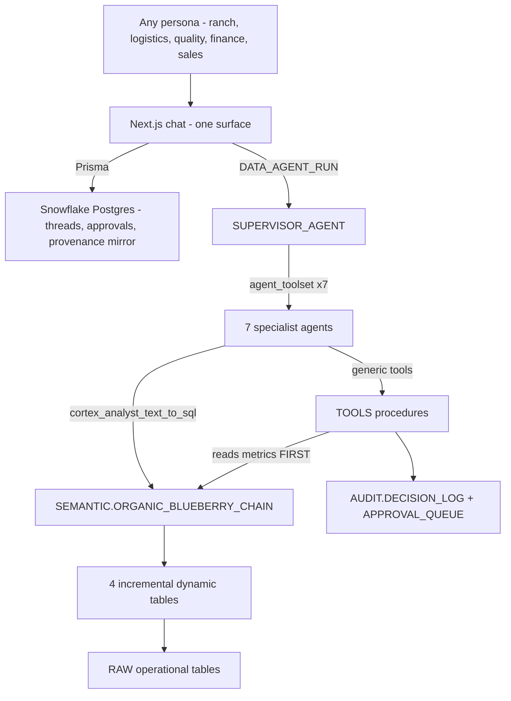

# BlueberryChain OS

An autonomous, chat-driven replacement for the traditional SAP module stack (PP, MM, LE/TM, QM, WM/EWM, SD, FI/CO) for an organic-blueberry farm-to-retail cold chain. Everything runs through **one conversation**. No screens, no transaction codes, no module hopping.

Built entirely on Snowflake: native Semantic Views, Cortex Agents, Cortex Analyst, Dynamic Tables, stored procedures as agent tools, Snowflake Postgres, and a Next.js front end.

---

## 1. What is actually deployed and verified

Everything below was deployed and executed live in account `IT92561` (`pndvhar-pt70809`, AWS ap-south-1).

| Layer | Object | Status |
|---|---|---|
| Database | `BLUEBERRY_CHAIN` with `RAW`, `CURATED`, `SEMANTIC`, `TOOLS`, `AUDIT`, `APP` | Deployed |
| Data | 199 harvest lots, 23,880 sensor readings, 195 shipments, 11,700 reefer telemetry rows, 732 inventory snapshots, 28 PO lines | Loaded |
| Dynamic tables | 4, all resolved to genuine `INCREMENTAL` refresh, `TARGET_LAG = 1 minute` | Active |
| Semantic view | `SEMANTIC.ORGANIC_BLUEBERRY_CHAIN` — 12 logical tables, 12 relationships, 48 metrics, 3 verified queries | Created |
| Agent tools | 11 stored procedures + 2 approval helpers | Created |
| Agents | 8 Cortex Agents (Supervisor + 7 specialists) | Created |
| App state | Snowflake Postgres `BBC_APP_PG` + 6 Prisma models | Migrated |
| Chat UI | Next.js 15 + Prisma + `snowflake-sdk` + Vega-Lite + react-markdown | Premium visual front end; runs locally, SPCS deploy blocked (see §8) |

### Demo results, measured

**Demo 1** — one sentence triggered an autonomous chain across 5 specialist agents: `HOLD_LOT` → `UPDATE_ATP` → `ADJUST_ORDER_PROMISE` (incl. the **Costco** Emerald PO, PO-6001) → `WRITE_CREDIT_NOTE` → `CALCULATE_TRUE_LANDED_COST` → `SEND_NOTIFICATION` → ranked alternative coverage → **asked for confirmation** before spending money. The UI renders it as: warm first-person acknowledgment → 19-step collapsible timeline → 6 governed metric cards → red hold card → Vega-Lite coverage chart → provisional credit-note card with a downloadable PDF → clickable next-action chips.

**Demo 2** — invoiced **all 47** Tracy DC arrivals at $11.20/kg: gross **$1,940,386.47**, shrink deduction **$52,729.29** derived from actual temperature history, net **$1,887,657.18**, 47 grower settlements raised, **0** left uninvoiced. Each of the 47 invoices is a **real, downloadable PDF** produced server-side. (Earlier runs reported $1,905,736.69 gross: those were silently priced at $11.00 because of the rounding bug described in §7. Proof 9 now guards against it.)

**Governance** — every audited action carries the exact metric snapshot read from the semantic view at decision time; proofs assert this rather than assume it.

---

## 2. Architecture



### The single-source-of-truth contract

A semantic view is a **query** construct — it cannot be written to. The requirement "all agents read *and write* through the semantic view" is therefore met like this:

- **Every read** of a canonical metric goes through `SEMANTIC.ORGANIC_BLUEBERRY_CHAIN`. No agent and no tool recomputes a metric in its own SQL.
- **Every write** goes through a `TOOLS` procedure that, as its *first* action, reads the metrics it is about to act on **from that same semantic view**, and writes those exact values into `AUDIT.DECISION_LOG.METRIC_SNAPSHOT` alongside the mutation.

That gives a stronger guarantee than the literal reading would: every state change is permanently joined to the governed metric values that justified it. Proof 2b in `sql/07_proof_queries.sql` asserts the recorded value still equals what the view returns.

---

## 2a. The conversational front end

The single interface is a Next.js app (`app/`) that feels like a modern Claude chatbot. It talks **only** to the Supervisor Agent — it never addresses a specialist directly, so every persona gets identical orchestration and identical numbers.

**What a response renders as** (parsed from the agent's event stream by `app/src/lib/agent-parser.ts`):

| Element | Component | Source |
|---|---|---|
| Warm first-person acknowledgment + structured **What I did / Numbers / Next** | `Markdown.tsx` (typewriter-streamed) | `text` blocks |
| Collapsible **action timeline** with per-agent icons and colour-coded status | `Timeline` | `tool_use` / `tool_result` blocks, whitelisted to the 13 action tools |
| **Metric cards** with big numbers + trend tone for the 7 canonical metrics | `MetricCards` | `metrics_used` in each tool result |
| **Status cards** (red hold / green released / amber pending) | `StatusCard` | hold/release/divert steps |
| **Charts** (temperature history, coverage ranking, shelf life) | `ArtifactChart` (Vega-Lite, bundled — no CDN) | `chart` blocks, whose `chart_spec` is a full Vega-Lite spec with inline data |
| **Downloadable documents** with in-app PDF preview | `DocumentCard` | `pdf_b64` / `doc_title` / `doc_summary` returned by the Finance tools |
| **Approval cards** with Approve / Reject buttons | `ApprovalCard` | `PENDING_APPROVAL` steps, executed via `TOOLS.APPROVE_ACTION` |
| **Suggested next-action chips** (e.g. "Yes, create replacement PO") | `SuggestedChips` | `suggested_queries` block |

**Progress:** because the Agents REST call returns a complete response rather than a token stream, the UI shows a per-run progress bar with an elapsed-time ticker while the chain runs, then streams the final text in a typewriter effect. Genuine token streaming (SSE) is a separate, larger change if you want it.

**Persistent memory:** conversations persist in Snowflake Postgres (threads, messages, artifacts). The sidebar lists them; resuming a thread rebuilds the full visual timeline from the stored artifacts and replays the history to the Supervisor, so context carries across turns and across sessions.

**Run it:**

```powershell
cd app
npm install
npm install-scripts approve @prisma/client prisma @prisma/engines   # npm 11+
npx prisma generate && npx prisma db push
npm run build
npm run start     # http://localhost:3000
```

Requires `app/.env.local` and `app/.env` (both gitignored) with Snowflake + Postgres credentials, and your IP in the `BBC_PG_INGRESS` network rule for Prisma to reach `BBC_APP_PG`.

---

## 3. The 7 canonical metrics

Each is defined **exactly once**, in `sql/04_semantic_view.sql`. Proof 4 asserts `COUNT(DISTINCT definition) = 1` for each.

| Metric | Grain | Definition |
|---|---|---|
| `SPOILAGE_RISK_SCORE` | lot | 0–100, quantity-weighted. Excursion severity (max 45) + firmness loss (25) + shelf-life erosion (20) + time out of compliance (10). 60+ CRITICAL, 35–59 HIGH, 15–34 MODERATE |
| `TEMPERATURE_COMPLIANCE_PCT` | lot | Minute-weighted % of sensor minutes at or below the **1.8 °C** organic blueberry pulp threshold |
| `SHELF_LIFE_ADJUSTED_OTD` | shipment | % of arrivals that were punctual **and** arrived with ≥7 days usable shelf life. A punctual delivery that burned its shelf life does not count |
| `QUALITY_ADJUSTED_FILL_RATE` | PO line | Accepted kg ÷ ordered kg. Uses *accepted*, so intake rejections correctly count as misses |
| `TRUE_LANDED_COST` | lot | product + freight + reefer energy + cold-chain shrink + quality claims |
| `LIVE_DOI` | inventory | On-hand ÷ avg daily demand. **Semi-additive** |
| `ATP_QUALITY_ADJUSTED` | inventory | On-hand − committed − held. **Semi-additive**. Excluding held stock is what makes it quality-adjusted |

### The semi-additive trap (and why it matters)

`INVENTORY` is a **daily snapshot** fact. A naive `SUM` across snapshot dates silently inflates every availability figure. Both inventory metrics declare `NON ADDITIVE BY (d_snapshot_date)`.

Measured on this data at Tracy DC:

| | kg |
|---|---|
| Semantic view returns (latest snapshot) | **485,029.38** |
| Naive sum across 5 snapshot dates | 1,688,967.11 |

Without the guard, availability would be overstated **3.5×**. Proof 3 asserts this.

---

## 4. Deploy from scratch

### Prerequisites

```powershell
# Snowflake CLI
uv tool install snowflake-cli        # or: pip install snowflake-cli
snow connection add                  # interactive

# Node 20+ for the UI
node --version
```

One account-level grant is required, or every AI call fails with `Unknown function AI_COMPLETE`:

```sql
GRANT USE AI FUNCTIONS ON ACCOUNT TO ROLE ACCOUNTADMIN;
ALTER ACCOUNT SET CORTEX_ENABLED_CROSS_REGION = 'ANY_REGION';
```

> **The single most common agent failure.** Cortex Agents resolve permissions from the caller's **DEFAULT role**, not the session role, and the user needs a **DEFAULT warehouse** with USAGE granted to that default role. If either is missing, agent calls fail even as `ACCOUNTADMIN`. Verify with `DESCRIBE USER <you>` before anything else.

### Run the SQL in order

```powershell
$C = "your-connection-name"
snow sql -c $C -f sql/01_foundation.sql       # db, schemas, roles, 14 tables
snow sql -c $C -f sql/02_seed_data.sql       # deterministic demo data
snow sql -c $C -f sql/03_dynamic_tables.sql  # 4 incremental DTs
snow sql -c $C -f sql/04_semantic_view.sql   # THE source of truth
snow sql -c $C -f sql/05_tools.sql           # 13 procedures
snow sql -c $C -f sql/06_agents.sql          # 8 Cortex Agents
snow sql -c $C -f sql/07_proof_queries.sql   # all 6 proofs
```

`02_seed_data.sql` is deterministic — it reproduces identical numbers on every run, which is what makes the proof queries meaningful.

Confirm the dynamic tables really got incremental refresh (requested is not the same as granted):

```sql
SHOW DYNAMIC TABLES IN SCHEMA BLUEBERRY_CHAIN.CURATED;
-- refresh_mode must read INCREMENTAL, not FULL
```

### App state and UI

```powershell
# Snowflake Postgres (already provisioned as BBC_APP_PG)
# Prisma needs network access - add your IP:
#   ALTER NETWORK RULE BLUEBERRY_CHAIN.APP.BBC_PG_INGRESS
#     SET VALUE_LIST = ('<your.ip>/32');

cd app
npm install
npm install-scripts approve @prisma/client prisma @prisma/engines   # npm 11+
npx prisma generate
npx prisma db push
npm run build
npm run start        # http://localhost:3000
```

Credentials live in `app/.env.local` (Next.js runtime) and `app/.env` (Prisma CLI). **Both are gitignored.**

---

## 5. Running the two demo conversations

Reset first so the pinned scenarios are intact:

```powershell
snow sql -c $C -f sql/99_reset_demo.sql
```

This restores the Ranch 14 Block 7 lot to `AVAILABLE` with its exact 3.8-hour excursion, and leaves all 47 Tracy DC arrivals uninvoiced.

### Demo 1 — temperature excursion

> Ranch 14 Block 7 Emerald blueberries harvested this morning show 3.8 hours above 1.8 °C. Handle it.

The Supervisor autonomously:

1. Reads `SPOILAGE_RISK_SCORE` = **69.3** (CRITICAL) and `TEMPERATURE_COMPLIANCE_PCT` = **68.33%**
2. `HOLD_LOT` — 4,200 kg withdrawn
3. `UPDATE_ATP` — availability recalculated
4. `ADJUST_ORDER_PROMISE` — exposed Emerald POs reassessed, including the **Costco** order (PO-6001)
5. `WRITE_CREDIT_NOTE` — provisional **$19,792.08**, auto-sized from the risk score, returned as a downloadable PDF
6. `CALCULATE_TRUE_LANDED_COST` — shrink posted, cost restated
7. `SEND_NOTIFICATION` — ranch manager + affected account managers
8. Ranks alternative coverage by temperature compliance (RANCH-09, 89.58%, risk 23.3)
9. **Stops and asks** before raising a replacement PO

Note step 9: `CREATE_PO` and `CREATE_HARVEST_REQUEST` are *never* auto-executed, and are **also** value-gated server side, so the guarantee does not depend on the model behaving. A PO above the $20,000 threshold is queued to `APPROVAL_QUEUE` and surfaces in the UI as an Approve/Reject card; approving it executes the action and flips the audit row to `EXECUTED`.

One honest detail worth showing in a demo: promise confidence comes back at **100%** because there genuinely is ~89,000 kg of Emerald ATP at Tracy. The agent is instructed not to manufacture alarm — it reports the exposure is covered and offers coverage anyway.

### Demo 2 — settle arrivals

> Generate final invoices for all blueberry shipments that arrived at Tracy DC yesterday and settle landed cost.

Produces 47 invoices with real shrink deductions, 47 grower settlements, per-lot True Landed Cost, and a **downloadable PDF for every invoice** — rendered in the UI as previewable document cards.

### Run them without the UI

```sql
SELECT SNOWFLAKE.CORTEX.DATA_AGENT_RUN(
  'BLUEBERRY_CHAIN.TOOLS.SUPERVISOR_AGENT',
  $${"messages":[{"role":"user","content":[{"type":"text",
     "text":"Ranch 14 Block 7 Emerald blueberries harvested this morning show 3.8 hours above 1.8 degrees C. Handle it."}]}]}$$,
  TRUE);
```

Then inspect what it actually did:

```sql
SELECT CREATED_AT, AGENT_NAME, TOOL_NAME, ENTITY_ID,
       METRIC_SNAPSHOT:SPOILAGE_RISK_SCORE::VARCHAR AS RISK,
       RESULT_SUMMARY
  FROM BLUEBERRY_CHAIN.AUDIT.DECISION_LOG ORDER BY CREATED_AT;
```

---

## 6. Autonomy configuration

Thresholds are **table-driven**, so they change without redeploying any procedure:

```sql
SELECT * FROM BLUEBERRY_CHAIN.TOOLS.AUTONOMY_POLICY;

UPDATE BLUEBERRY_CHAIN.TOOLS.AUTONOMY_POLICY
   SET VALUE_THRESHOLD_USD = 50000
 WHERE TOOL_NAME = 'CREATE_PO';
```

| Level | Behaviour | Tools |
|---|---|---|
| `FULL_AUTO` | Executes immediately | `HOLD_LOT`, `UPDATE_ATP`, `ADJUST_ORDER_PROMISE`, `GENERATE_INVOICE`, `CALCULATE_TRUE_LANDED_COST`, `SEND_NOTIFICATION` |
| `THRESHOLD` | Executes below the USD threshold, otherwise queues | `RELEASE_LOT` (25k), `CREATE_PO` (20k), `CREATE_HARVEST_REQUEST` (20k), `DIVERT_LOT` (15k), `WRITE_CREDIT_NOTE` (10k, final only) |
| `APPROVAL_REQUIRED` | Always queues | available, unused by default |

Enforcement is **server side, inside the procedure** — a queued action returns `PENDING_APPROVAL` and performs no mutation. Proof 5 asserts no pending approval ever leaked a side effect.

Approve or reject:

```sql
CALL BLUEBERRY_CHAIN.TOOLS.APPROVE_ACTION('APR-000001', 'Need Emerald coverage');
CALL BLUEBERRY_CHAIN.TOOLS.REJECT_ACTION('APR-000002', 'Source elsewhere');
```

---

## 7. The agents

| Agent | Owns |
|---|---|
| `SUPERVISOR_AGENT` | **Entry point.** Orchestration playbooks, routing, all 7 toolsets, charting |
| `COLD_CHAIN_AGENT` | `HOLD_LOT`, `DIVERT_LOT`, `SEND_NOTIFICATION` |
| `FINANCE_AGENT` | `GENERATE_INVOICE`, `WRITE_CREDIT_NOTE`, `CALCULATE_TRUE_LANDED_COST` |
| `QUALITY_GATE_AGENT` | `HOLD_LOT`, `RELEASE_LOT` |
| `INVENTORY_ATP_AGENT` | `UPDATE_ATP` |
| `ORDER_PROMISE_AGENT` | `ADJUST_ORDER_PROMISE`, `SEND_NOTIFICATION` |
| `HARVEST_AGENT` | `CREATE_HARVEST_REQUEST` |
| `PROCUREMENT_AGENT` | `CREATE_PO` |

All eight are fully implemented. Each specialist is also usable standalone in Snowsight.

### How `agent_toolset` actually behaves

Two properties that matter and are easy to get wrong:

1. **It inherits tools only, not instructions.** The Supervisor therefore carries the whole orchestration playbook itself. The specialists exist so each tool is defined in exactly one place.
2. **A missing `USAGE` grant is silently skipped** — no error, no warning, the run just quietly loses those tools. The grants at the bottom of `06_agents.sql` are load-bearing. Proof 6 verifies all 8 exist and all 8 are granted.

### Adding a ninth agent

1. Write the procedure in `sql/05_tools.sql` following the five-step contract (read metrics from the view → resolve autonomy → execute or queue → audit with snapshot → return VARIANT).
2. Add a row to `TOOLS.AUTONOMY_POLICY`.
3. Add a `CREATE OR REPLACE AGENT` block in `sql/06_agents.sql` with a `cortex_analyst_text_to_sql` tool plus its `generic` tools.
4. Add an `agent_toolset` entry **and** its `tool_resources.agent_name` to `SUPERVISOR_AGENT`.
5. `GRANT USAGE ON AGENT ... TO ROLE BBC_AGENT_ROLE` — without this it is silently skipped.
6. Add the tool name to `ACTION_TOOLS` and its label/agent to `TOOL_LABEL` / `TOOL_AGENT` in `app/src/lib/agent-parser.ts` so it shows in the UI timeline.

### Tool-authoring gotchas learned the hard way

- **A bare `NUMBER` is `NUMBER(38,0)` — it rounds money silently.** Procedure parameters declared `P_UNIT_PRICE NUMBER` turned 11.20 into 11 and 7.10 into 7 with no error, and `:payload:price::NUMBER` does the same inside a procedure. Every money and quantity parameter and cast is now `NUMBER(10,4)` / `NUMBER(14,2)`. Proof 9 asserts the issued PO equals the queued price and that invoice prices keep their cents.
- **Custom tools call procedures with named arguments, so every declared parameter must be supplied.** Omitting one gives `named arguments [...] do not match any signature`. There is no partial application. `WRITE_CREDIT_NOTE` therefore uses a `0` sentinel for "auto-size" instead of a nullable number — passing `"null"` for a numeric fails to bind (`Invalid bind value (null) for type (REAL)`).
- **Sequence `NEXTVAL` is not valid in a Snowflake Scripting `:=` assignment.** Use `SELECT 'X-' || LPAD(SEQ.NEXTVAL, 8, '0') INTO :v;` instead. The failure message is badly mangled and unhelpful.
- **A SQL UDF cannot take bind variables in its body**, so the internal `BUILD_SIMPLE_PDF` helper is a **JavaScript** UDF (which reads its ARRAY argument directly). Calling a *procedure* as an expression fails with `Unknown user-defined function` — it must be a function.

---

## 8. Known limitations

These are real and stated plainly rather than papered over.

1. **SPCS deployment is blocked on this account.** `snow app deploy` fails with `Snowpark Container Services feature SNOWFLAKE APP RUNTIME not available for trial accounts`. This is an account-type restriction, not a code defect — `app.yml` validates, the code bundle uploads successfully, and the deploy will complete unchanged once SPCS is enabled. Until then run the UI locally (`npm run start`), which is fully verified against live Snowflake and live Postgres.

   **Deployed today in Snowflake:** BlueberryChain OS is hosted in **Snowflake CoWork** at <https://ai.snowflake.com> (account identifier `PNDVHAR-PT70809`), set up at the end of `sql/06_agents.sql`. It is the same Supervisor with the same tools, autonomy gates and audit trail as the Next.js app. Because CoWork has no custom UI, two capabilities are delivered through the conversation instead:

   - **Downloadable documents:** `TOOLS.GET_DOCUMENT_LINKS` writes the stored PDFs to the `TOOLS.BBC_DOCS` stage (server-side encrypted, required for browser downloads) and returns 7-day presigned links, which CoWork renders as **Download** links. All 47 Demo 2 invoices are published in a single call (~12 s).
   - **Approvals in chat:** a queued action is approved by replying `Approve APR-...` (or `Reject APR-...`). `TOOLS.DECIDE_APPROVAL` refuses to act unless the message it is handed names the approval id and the decision; a vague "ok sounds fine" returns `NEEDS_CONFIRMATION` and nothing runs. Honest limit: the procedure cannot prove the text came from the human rather than the model, so that part rests on the agent instructions. The Next.js app's Approve button calls `APPROVE_ACTION` directly and does not depend on the model.

   CoWork contributes its own live task list, tables, charts and follow-up suggestions. What it doesn't have is this app's metric cards and inline PDF preview.

   **Sharing it.** CoWork is not a public link: each viewer signs in to this Snowflake account. To add someone, edit the three values at the top of `sql/10_share_access.sql` and run it as `ACCOUNTADMIN`. It creates their user with `BBC_AGENT_ROLE` (full demo access: both demos plus chat approvals), a generated temporary password they must change at first sign-in, and returns the details to send them privately. Remove access with `DROP USER <login>;`.

2. **Prisma has no Snowflake connector.** It therefore owns *application state only* (threads, messages, tool timeline, approvals mirror, provenance mirror) in Snowflake Postgres. Every supply-chain number comes through `snowflake-sdk` from the semantic view. This split is deliberate: it is what keeps the semantic view the single source of truth rather than letting the app compute its own figures.

3. **Snowflake Postgres needs an IP allowlist.** `BBC_APP_PG` is reachable only from IPs in `BLUEBERRY_CHAIN.APP.BBC_PG_INGRESS` (currently one workstation). A deployed SPCS app would need its egress added.

4. **Freight and energy are $0 for today's lots.** Lots harvested today have not shipped, so they have no freight or reefer rows — `TRUE_LANDED_COST` is product-only for them. This is correct, not a bug, and the agent reports it that way.

5. **The `cortex` CLI was unavailable**, so semantic views and agents are managed with native DDL (`CREATE SEMANTIC VIEW`, `CREATE AGENT ... FROM SPECIFICATION`) rather than `cortex agent-studio`. Both are fully supported; DDL is arguably better for a version-controlled repo.

---

## 9. Repository layout

```
sql/
  01_foundation.sql      database, schemas, 2 warehouses, 5 roles, 14 tables
  02_seed_data.sql       deterministic demo data, both scenarios pinned
  03_dynamic_tables.sql  4 incremental dynamic tables
  04_semantic_view.sql   THE single source of truth
  05_tools.sql           11 agent tools + approval helpers + PDF builder + CoWork doc/approval tools
  06_agents.sql          8 Cortex Agents
  07_proof_queries.sql   9 proofs, all asserted
  08_premium_enrichment.sql  Costco PO + document payload columns
  10_share_access.sql    add a CoWork viewer (user + role + temp password)
  99_reset_demo.sql      restore pinned demo state
app/
  app.yml                SAR manifest (v2)
  prisma/schema.prisma   6 models - app state only
  src/lib/agent-parser.ts  agent envelope -> typed timeline + artifacts
  src/lib/snowflake.ts   agent invocation, audit reads, response parsing
  src/lib/prisma.ts      Postgres client
  src/app/api/chat/      the single chat endpoint
  src/app/api/approvals/ human-in-the-loop decisions
  src/components/artifacts.tsx  timeline, metric cards, status cards, charts, documents, approvals, chips
  src/components/Chat.tsx  the premium conversational surface
```

### Teardown

```sql
DROP DATABASE IF EXISTS BLUEBERRY_CHAIN;
DROP POSTGRES INSTANCE IF EXISTS BBC_APP_PG;
DROP WAREHOUSE IF EXISTS BBC_WH;
DROP WAREHOUSE IF EXISTS BBC_DT_WH;
DROP NETWORK POLICY IF EXISTS BBC_PG_POLICY;
DROP ROLE IF EXISTS BBC_AGENT_ROLE;
DROP ROLE IF EXISTS BBC_HARVEST_ROLE;
DROP ROLE IF EXISTS BBC_LOGISTICS_ROLE;
DROP ROLE IF EXISTS BBC_QUALITY_ROLE;
DROP ROLE IF EXISTS BBC_FINANCE_ROLE;
```

> `BBC_APP_PG` bills for compute and storage while it exists. Drop it when you are done demoing.
